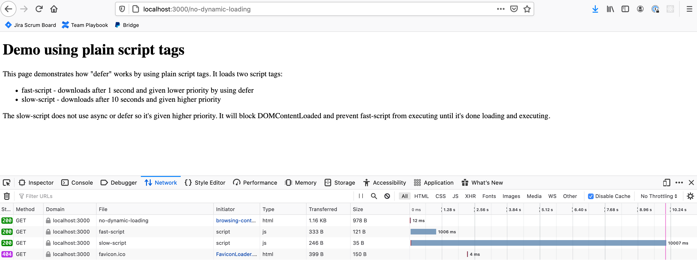
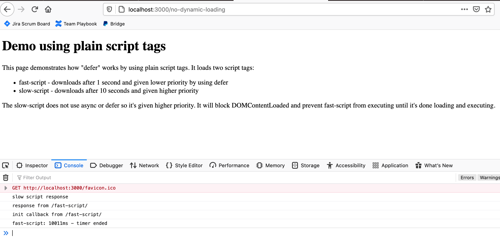

# Dynamic Script Loading Demo

The purpose of this repo is to test out how the `async` and `defer` attributes work when doing dynamic script loading.

## Getting Started

* Clone the repo
* Install dependencies with `npm install`
* Run server with `npm start` and go here:
[http://localhost:3000/](http://localhost:3000/)

## What to look for in the demos

There are two things to look for in the demos:
1. To measure script loading, check the Dev Tools network tab.

2. To measure script execution, check the Dev Tools console.

## Does defer work with dynamic script loading?

No, I don't believe so. I've tested these demos in Chrome and Firefox and defer/async don't seem to change behavior of the dynamically loaded scripts.
There may be a problem with these demos or something I'm not understanding. Feedback welcome.
